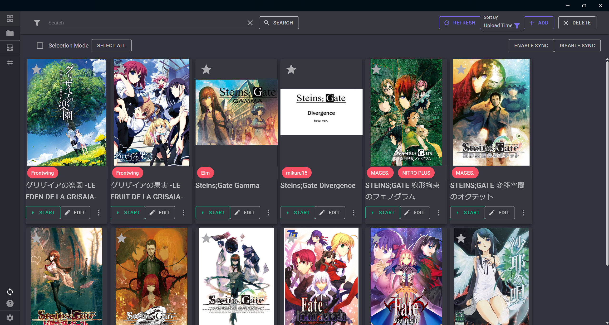

# GameManager

[English](./GameManager.md) | [简体中文](./GameManager.zh-tw.md)

- [GameManager](#gamemanager)
  - [使用指南](#使用指南)
    - [手動添加遊戲](#手動添加遊戲)
    - [自動掃描遊戲](#自動掃描遊戲)
    - [整合 Locale Emulator](#整合-locale-emulator)
    - [整合 Sandboxie-Plus](#整合-sandboxie-plus)
    - [整合 VNGTTranslator](#整合-vngttranslator)
    - [整合您的自訂工具](#整合您的自訂工具)
    - [備份和還原存檔文件](#備份和還原存檔文件)
      - [備份](#備份)
      - [還原](#還原)
    - [更改顯示模式](#更改顯示模式)
  - [開發](#開發)
    - [要求](#要求)
    - [數據庫模型變更](#數據庫模型變更)

## 使用指南

### 手動添加遊戲

1. **從本地加入**

   - 點擊 `加入` 按鈕。
   - 選擇 `從本地加入`。
   - 選擇可執行檔（exe）文件。

2. **從壓縮檔加入**

   - 點擊 `加入` 按鈕。
   - 選擇 `從壓縮檔加入`。
   - 選擇壓縮檔案。
   - 設定目標資料庫和遊戲路徑。
   - 壓縮檔案將會解壓縮到 `目標資料庫/遊戲路徑` 資料夾中。

3. **安裝遊戲**
   - 從工具頁面安裝 `ProcessTracer`。
   - 點擊 `加入` 按鈕。
   - 點擊 `安裝遊戲`。
   - 選擇是否使用 `Locale-Emulator`。
   - 選擇安裝文件。
   - 完成安裝過程。

### 自動掃描遊戲

- 將文件夾添加到`Library`，然後點擊`掃描`按鈕。
- 程式將掃描`Library`文件夾內最多 8 層子目錄，直到找到 exe 文件。

### 整合 Locale Emulator

整合 Locale Emulator 的兩種方式：

1. **通過安裝整合 Locale Emulator**

   - 在 `設定` 頁面中設置 `Locale Emulator 路徑`。
   - 在`遊戲`頁面點擊`編輯`。
   - 選擇 `LE 設定` 選項，使用 Locale Emulator 啟動遊戲。

2. **無需安裝整合 Locale Emulator**

   - 前往 `工具` 頁面。
   - 點擊 `下載` `Locale-Emulator` 工具。
   - 如果 `設定` 頁面中的 `Locale Emulator 路徑` 尚未設置，則下載工具後會自動配置。
   - 在`遊戲`頁面點擊`編輯`。
   - 選擇 `LE 設定` 選項，使用 Locale Emulator 啟動遊戲。

### 整合 Sandboxie-Plus

- 在 `設定` 頁面中設置 Sandboxie-Plus 的路徑。
- 點擊 **編輯**。
- 啟用選項 `使用 Sandboxie 執行`。
- 編輯 `Box Name` 欄位以指定目標的 Sandboxie 沙盒名稱。

### 整合 [VNGTTranslator](https://github.com/charles7668/VNGTTranslator)

- 前往`工具`頁面
- 點擊`下載`（如果未安裝）
- 前往遊戲編輯頁面
- 勾選`RunWithVNGTTranslator`

### 整合您的自訂工具

- 前往`工具`頁面
- 點擊`打開工具文件夾`
- 將您的程序放置在具有以下結構的文件夾中（執行文件名應與文件夾名相同），或者放置`conf.vngt.yaml`來指定工具名稱和執行路徑：

  ```shell
  tools\
      your-custom-tool\
          your-custom-tool.exe
  ```

  或

  ```yaml
  Name: your-custom-tool-name
  ExeName: path-to-your-custom-tool # 相對於 tools/your-custom-tool 文件夾
  RunAsAdmin: true
  ```

### 備份和還原存檔文件

#### 備份

- 在遊戲信息編輯器中設置存檔文件位置。
- 點擊 `⋮` 打開遊戲信息菜單。
- 點擊 `存檔管理`。
- 點擊 `備份存檔`。
- 存檔文件將備份到設置的存檔文件位置，並以日期作為存檔名稱。

#### 還原

- 在遊戲信息編輯器中設置存檔文件位置。
- 點擊 `⋮` 打開遊戲信息菜單。
- 點擊 `存檔管理`。
- 點擊 `復原存檔`。
- 選擇要還原的日期。請注意，此操作將替換原始數據。

### 更改顯示模式

- 前往設定頁面，將顯示模式（DisplayMode）設為 `List` 或 `Grid`

Grid 模式預覽：  


List 模式預覽：  


## 開發

### 要求

- 使用`dotnet tool install --global dotnet-ef`安裝`dotnet-ef`

### 數據庫模型變更

如果需要詳細訊息，使用以下命令時可以添加`--verbose`

添加遷移

```shell
dotnet ef migrations add {MigrationName} --project .\GameManager.DB --startup-project .\GameManager.DB.Migrator
```

移除遷移

```shell
dotnet ef migrations remove --project .\GameManager.DB --startup-project .\GameManager.DB.Migrator
```
