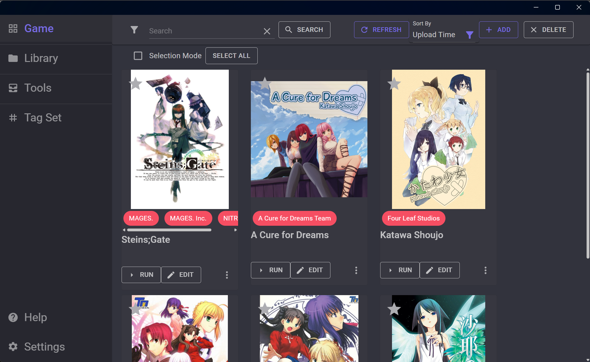

# VNGT

[English](../README.md) | [简体中文](./README.zh-cn.md)

下載 : [點我](https://github.com/charles7668/VNGT/releases/)

遊戲管理工具：輕鬆管理您的遊戲，並集成多種遊戲輔助工具。

- 自動掃描資料夾以查找遊戲
- 自動下載遊戲資訊（目前支援：[vndb](https://vndb.org/)）
- 支援多種語言
- 整合 Locale Emulator 以支援非日文操作系統
- 整合[VNGTTranslator](https://github.com/charles7668/VNGTTranslator)以幫助用戶翻譯遊戲文本
- 存檔修改器可以替換存檔以解鎖遊戲 CG 或替換存檔
- 支援加入自訂的遊戲工具
- 支持備份和還原存檔文件（最多可備份 10 個文件）
- 支援追蹤遊戲安裝
- 支援從壓縮檔中新增新遊戲
- 支持使用 [Sandboxie-Plus](https://sandboxie-plus.com/) 開啟遊戲

## 使用指南

- [遊戲管理器](./GameManager.zh-tw.md)
- [存檔修改器](./SavePatcher.zh-tw.md)

## 構建

### 要求

- [.NET 8](https://dotnet.microsoft.com/en-us/download)

運行`build.bat`文件以構建專案。

構建結果將在`bin`目錄中。
