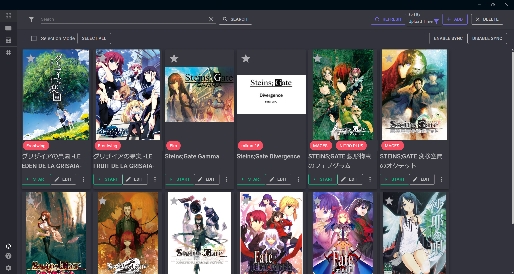
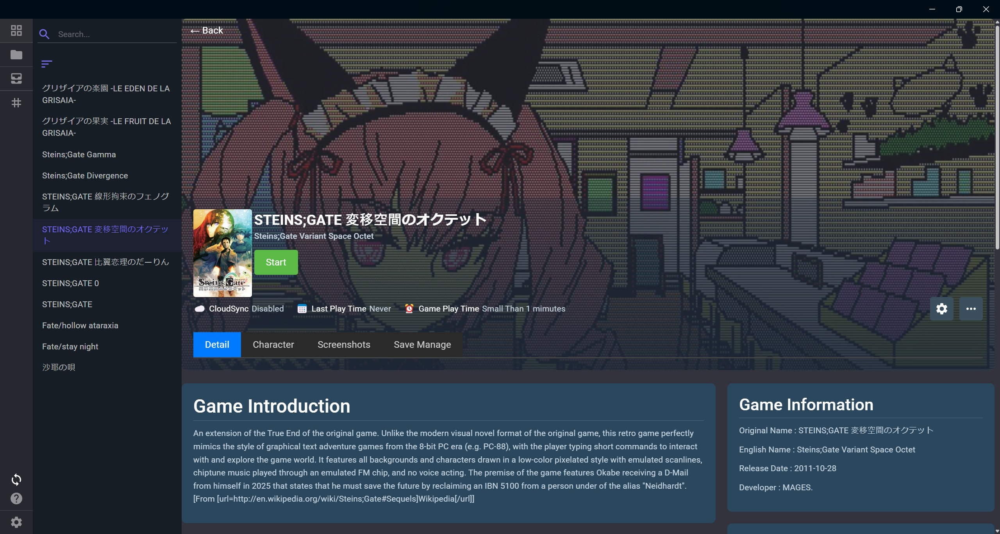
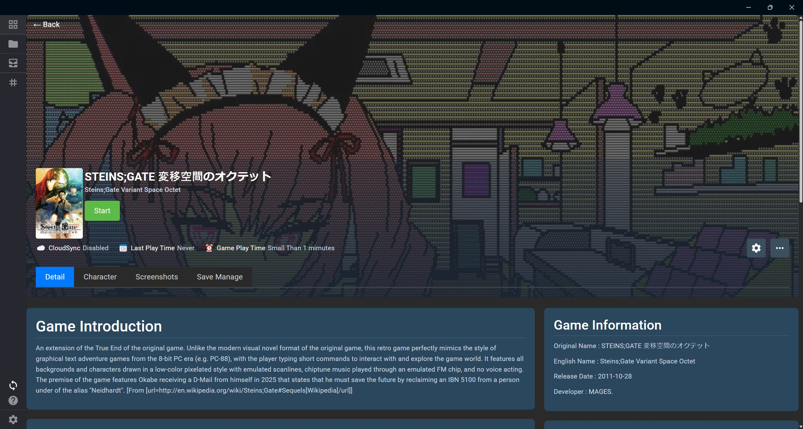
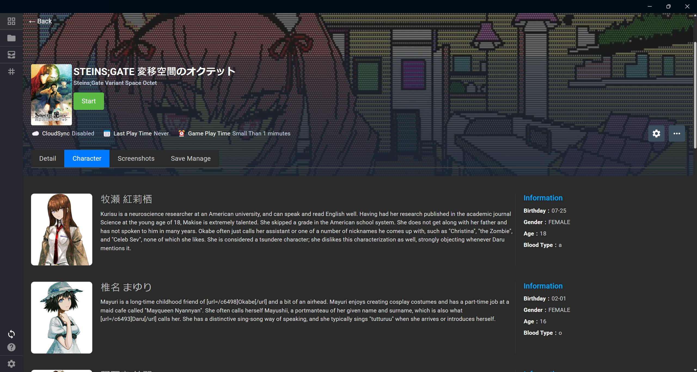

# VNGT

[繁體中文](./Docs/README.zh-tw.md) | [简体中文](./Docs/README.zh-cn.md)

Download : [Click Me](https://github.com/charles7668/VNGT/releases/)

Game management tool: easily manage your games and integrate various assistive tools for gaming.

- Automatically scan folders for games
- Automatically download game information (currently supported: [vndb](https://vndb.org/) , [DLSite](https://www.dlsite.com) , [ymgal](https://www.ymgal.games/developer#%E6%90%9C%E7%B4%A2%E6%B8%B8%E6%88%8F%E5%88%97%E8%A1%A8))
- Support multiple languages (english , 简体中文 , 繁體中文)
- Integrate Locale Emulator to support non-Japanese OS
- Integrate [VNGTTranslator](https://github.com/charles7668/VNGTTranslator) to help users translate game text
- Save patcher can replace save data to unlock game CG
- Support execution of your game tool
- Support backup and restore of save files (up to 10 backup files)
- Support tracing game installation
- Support adding new games from archives
- Support using [Sandboxie-Plus](https://sandboxie-plus.com/) to launch games
- Support backup and restore settings

## Guide

- [Game Manager](./Docs/GameManager.md)
- [Save Patcher](./Docs/SavePatcher.md)

## Build

### Requirement

- [.NET 8](https://dotnet.microsoft.com/en-us/download)

Run the `build.bat` file to build the project.

The build result will be in the `bin` directory.
